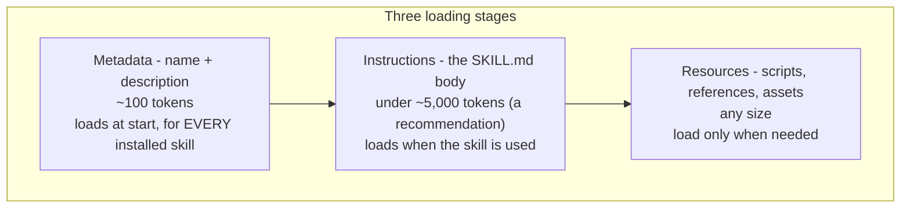
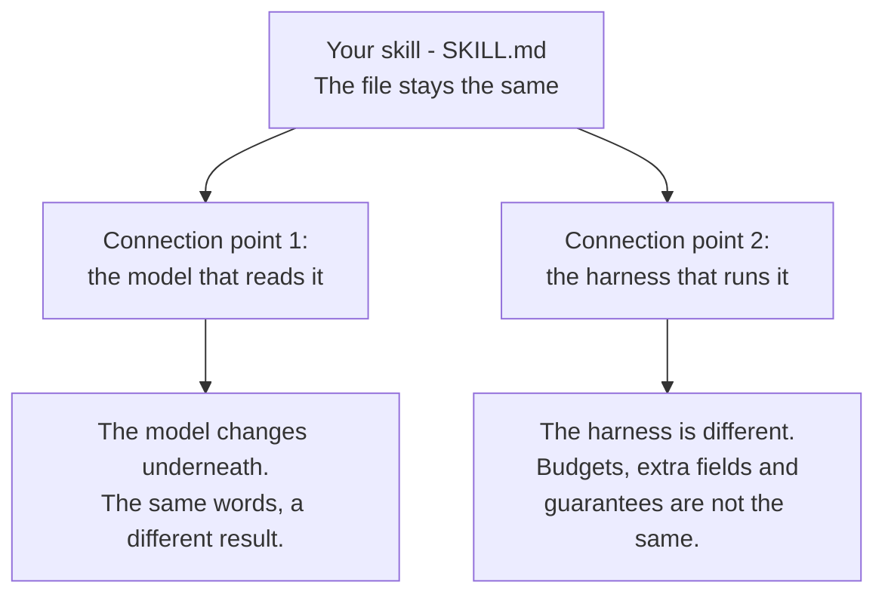
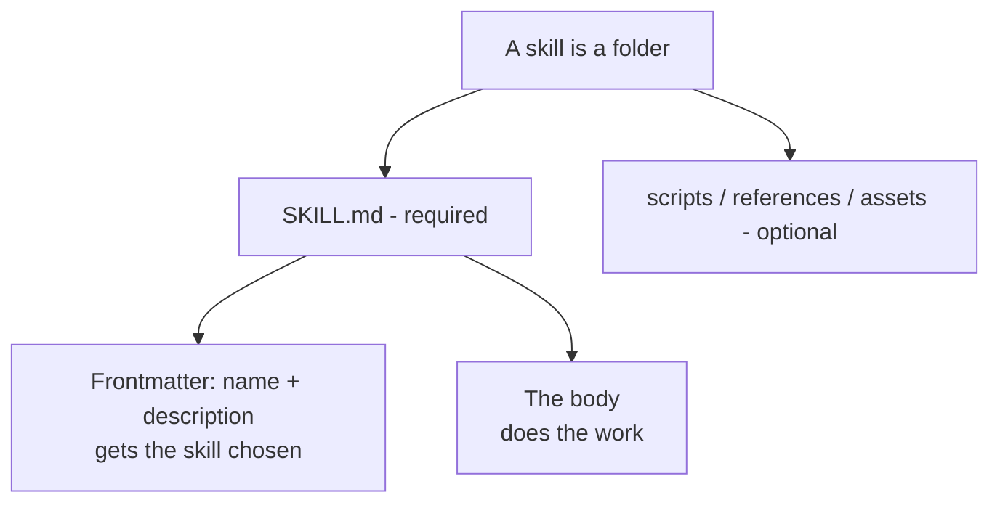
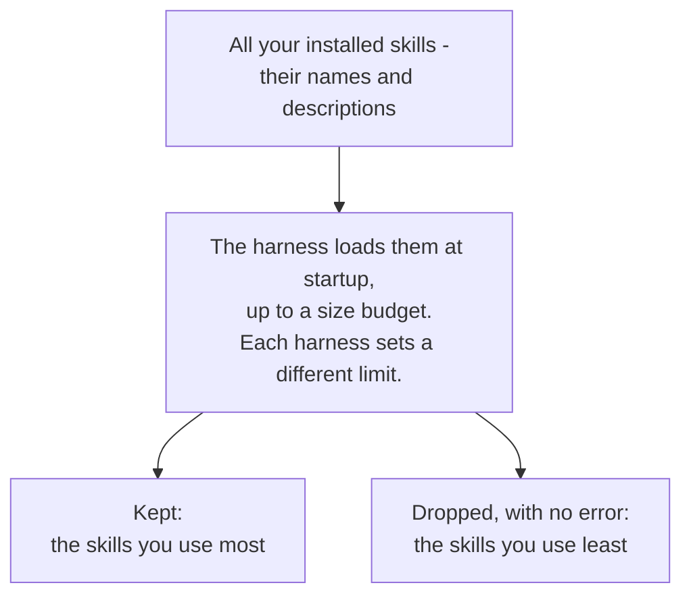
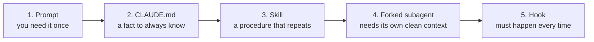
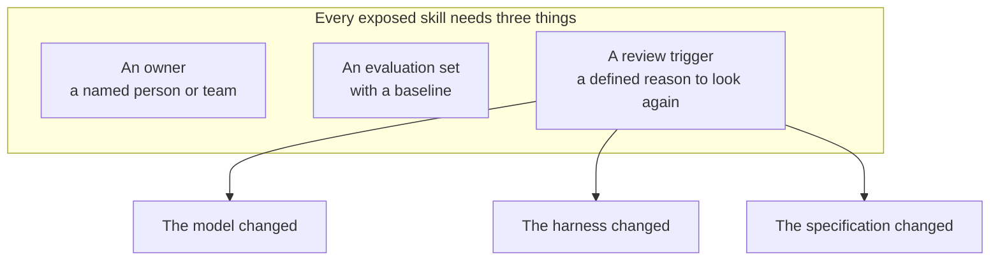

Consider a team that ships a code-review skill. For months it earns its place. It reads a pull request, points out the real problems, and moves on. Then, without any warning, it starts to find less. Bugs it used to catch begin to slip through. Someone opens the history, expecting to find a bad edit, and finds nothing at all. The file that reviewed last quarter's changes is exactly the same as the file reviewing this quarter's. Nothing was touched. The results still got worse.

This is the uncomfortable property of an Agent Skill. A skill is a lasting asset. You write it once, and a whole team uses it. But it is not permanent, and it will not warn you when it stops being good. The usual tools an engineer trusts to notice this kind of slow decline are all blind here. Version control shows no change. There is no failing test, no error message, no diff to read. **The decay is real, but it does not live in the file. It lives at the connection points, where a skill meets a particular model and a particular harness - the program that runs it.**

## The same file works everywhere

Start with the good news, because it is genuinely good. A skill is a small, portable thing. It is a folder with one required file, `SKILL.md`, which holds a little metadata and some instructions written in plain Markdown. Only the metadata loads when a session starts: a name and a description, on the order of a hundred tokens. The body of the file loads later, on demand, when a task actually needs it. The specification suggests keeping that body under roughly five thousand tokens, but this is a recommendation, not a hard limit. This is the whole reason skills exist as something more than a longer instruction file. You can write a detailed procedure, and it costs almost nothing until someone needs it.

Because a skill is just files that follow an [open standard](https://agentskills.io/specification), the same `SKILL.md` runs across tools built by different vendors, with no changes.

Here is how Daniel Vaughan describes a set of skills written for one tool:

> If you have invested time building skills for Codex CLI, you may not realise that those same files already work - unchanged - in Claude Code, Gemini CLI, Cursor, Kiro, and at least 28 other tools.

Hold on to that word, _unchanged_. It is the reason the failure is invisible. The portable core really is the same everywhere, and most of the time it keeps working. So when a skill quietly loses value, the file is not where the loss happened. If the same file behaves differently, the change came from underneath it.

A skill sits on top of two things it does not control: the model that reads it, and the harness that runs it. Each of those can move. The places where your fixed instructions meet those moving parts are the connection points, and they are where a skill quietly goes wrong.

## Two jobs, and the first small difference

A `SKILL.md` does two jobs, and they pull in different directions. The description gets the skill _selected_. An agent reads it to decide, out of many available skills, whether this is the one for the task in front of it. The body does the work, once the skill has been chosen. Selling and doing are different jobs, and they reward different kinds of writing.

Even here, at the most basic level, the rules change from one harness to the next. The open standard recommends writing the description as an instruction to the agent - imperative phrasing, "_Use this skill when..._" rather than "_This skill does..._". Anthropic's own [best-practices guidance](https://platform.claude.com/docs/en/agents-and-tools/agent-skills/best-practices tells you to do the opposite:

> Always write in third person. The description is injected into the system prompt, and inconsistent point-of-view can cause discovery problems.

Neither rule is wrong. Each is tuned to a particular reader. But it means that the most basic advice about a skill - how to phrase the one field that decides whether it runs at all - is not really a fact about skills. It is a fact about a skill on a particular harness. This is the same problem in its smallest form. The rest of this article is the same shape at a larger scale.

## Where a skill meets the model

A skill is an instruction, and an instruction has to be interpreted. The model is the interpreter. Change the interpreter, and the same words can mean something slightly different. Nobody rewrote them. The thing reading them moved.

This is not a vendor's excuse. It is a measurable effect, and the clearest evidence comes from outside the vendors entirely. In a study of evolving model APIs, researchers at Carnegie Mellon found this:

> LLM APIs are often updated silently and scheduled to be deprecated, forcing users to continuously adapt to evolving models. This can cause performance regression and affect prompt design choices, as evidenced by our case study on toxicity detection.

Their case study was narrow - a single task, toxicity detection - but the shape of the finding was clear. When the model changed, some prompts lost accuracy and others gained, and you could not tell which without testing. The prompt did not change. The model underneath it did, and the result moved on its own - silently, and in a direction you could not predict.

Anthropic describes the same effect on its own models, and it is worth naming the incentive plainly. This is a vendor writing about its own product, and it has an interest in framing a regression as something you can fix rather than something it broke. Read as self-reported, then: the migration guidance for Claude Fable 5 says that skills written for earlier models are often too prescriptive, and that this can reduce output quality. For years the advice ran the other way. Be more explicit. Spell everything out. That advice has a shelf life. The guidance for Claude Opus 4.8 is sharper still, and it describes the kind of case we opened with:

> if your code-review harness was tuned for an earlier model, you may initially see lower recall. This is likely a harness effect, not a capability regression.

The explanation the vendors give - and it does fit the logic - is that a newer model follows instructions more literally. Suppose a review skill says _report only high-severity issues_. The older model quietly over-reported, and caught the smaller problems anyway. The newer model does what you actually wrote. The instruction was always slightly wrong, and the model simply stopped compensating for it. Precision goes up, measured recall falls, and the file that produced both results has not changed. Anthropic's Fable 5 guidance notes a related behaviour: asking a model to narrate its own reasoning as output can trigger a refusal. Each of these is a case where working instructions quietly stop working. Nothing in the file has moved. Only the reader has.

## Where a skill meets the harness

The second connection point is the harness. Claude Code, GitHub Copilot and OpenAI Codex all read the same open standard, which is why the same file works across them. The differences are underneath, and you meet them the moment a skill reaches for anything beyond plain instructions. **What you gain by opting in, you pay for in coupling** - and each difference below is another quiet way a skill can stop being offered, or stop behaving as it did. Four of them matter most.

### Where skills live

Put a shared set of skills in the neutral `.agents/skills` folder, and both Codex and Copilot will read it - but Claude Code will not. Claude Code reads only its own `.claude/skills`, so a set you want all three to use needs a copy there as well. One folder is never read by every harness at once.

### The discovery budget

Every harness limits how much of your skill list it will load at startup, and no two of them publish the same number. Claude Code budgets around one percent of the context window; Codex, about two percent; Copilot publishes no number at all. When the limit is reached, the harness quietly drops the skills you use least. This is the harness-side version of silent decay. Install enough skills and one of yours simply stops being offered. No error is raised - at most a startup warning that is easy to miss - because nothing has gone wrong from the harness's point of view.

### Who chooses the model

In Claude Code, a skill can pin the model it wants. Under Codex, it cannot. Under Copilot, the person picks, and the default "Auto" setting weighs availability and rate limits alongside how well a model fits the task. So the whole question of the previous section - a skill tuned to a model - only applies when the skill, or you, actually get to choose that model.

### The extra fields

The fields that make a skill powerful in Claude Code - pinning a `model`, forking a subagent, attaching `hooks` - are additions to the standard. On another harness they are not errors. They are simply ignored. A skill that leans on them has bought real power from one harness, and paid for it in coupling to that harness. Those are the skills most exposed to a silent change underneath them.

## Skills ask, hooks enforce

There is a limit to what any skill can promise, and it matters most for the rules you cannot afford to have broken. A skill is an instruction, and an instruction is usually followed. Usually is not always. If a behaviour must happen every single time - a security control, a release gate, a compliance rule - then a skill is the wrong tool, and no amount of careful wording will fix that. This is the honest boundary of the whole idea. Anything that truly must not drift does not belong in prose that a model may reinterpret. It belongs in code that runs outside the model. That is a hook.

Think of a skill as one rung on a ladder, chosen by how certain you need the behaviour to be.

_Less certain on the left, more certain on the right. Rungs 4 and 5 are harness features, not part of the open standard. A hook is not a bigger skill - it is code that runs outside the model._

But the strength of a hook is itself a connection point, and the promise is not the same across harnesses - so read the promise on the harness you actually run, not the one you read about. Claude Code documents the most far-reaching version:

> A hook that returns `permissionDecision: "deny"` blocks the tool even in `bypassPermissions` mode or with `--dangerously-skip-permissions`.

A developer cannot avoid the rule by loosening their own settings. The guarantee is also one-directional, and that is the part people miss. A hook can tighten a restriction, but it cannot loosen one. An "allow" never overrides a deny that came from somewhere else. Copilot supports hooks in both its command line and its cloud agent, and its own documentation is candid that the configuration is mostly the same between the two, but the set of events that can fire is not - so a control you tested locally is not automatically the same control in the cloud. Codex is the most explicit about its own limits:

> Treat tool hooks as a useful guardrail, not a complete enforcement boundary.

That is one vendor telling you, in its own documentation, not to rely on the mechanism completely. It is exactly the sentence you want to read before you build a compliance control on top of it. **A skill asks. A hook enforces.** But the enforcement is a promise made by a harness, and the promises are not the same - which is why you read the one you are actually running under.

## Spend your attention where the risk is

If value drops silently at the connection points, then that is where attention should go, and almost nowhere else. Three things keep a skill honest across a change it cannot see.

### An owner

A named person or team - not a shared folder that everyone can edit and no one is answerable for.

### An evaluation set with a baseline

This is what lets you tell "the skill still runs" apart from "the skill still works". Those are two different questions. They fail for different reasons, and they have to be measured separately.

### A review trigger

A defined reason to look again: the model changed, the harness changed, or the specification changed. Those three triggers are simply the connection points read backwards. Not every change announces itself, though. A hosted model can be updated underneath you, and Copilot's Auto can swap it for you - so the trigger catches the upgrades you choose, and the standing evaluation set is what catches the ones you do not.

The supporting habit is dull and reliable. Write the evaluations before the long documentation, and test the skill on every model you plan to run it on.

**None of this is a tax you owe on every skill. It is a cost you scale to a skill's reach and stakes.** Steve Kinney puts the lower bound well:

> If your always-on file is under 200 lines and covers everything you need, you probably don't need skills yet.

For a small team with a short always-on file, that answer is not a failure. It is a result. It means none of your skills yet cross the line where the full treatment pays for itself, and knowing that is worth as much as the work itself would be.

An evaluation set is not free. Keeping one is ongoing work, and a baseline is itself a document that can go stale if no one keeps it up to date - which is the honest reason the whole discipline is reserved for the skills whose reach and stakes earn it. The owner owns the baseline too. Where the check can pay for itself, let it: a commit hook that rejects a badly formed message is, at no extra cost, a standing test that the skill still writes a good one.

Reach and stakes do not always move together, and the gap between them is where the judgement lives. A skill that reformats a changelog is low on both: if it degrades, you notice, and you move on. A skill that gates every commit is high on both, and it tends to be coupled to one harness on purpose - pinning a model, leaning on a hook - so it plainly earns the full treatment.

The case people most often miss sits between the two. A skill that summarises a large diff - so a reviewer can approve a change without reading every line - can be completely portable, with no pinned model and no hook, and still run a hundred times a week across every repository. Its reach is high even though its coupling is low. And because people trust its summary instead of reading the diff themselves, a slow decline in what it catches leaves no trace. That is exactly the skill the model connection point can degrade in silence, and exactly the skill an owner and an evaluation set exist to protect. Reach earns the evaluation set on its own; coupling only raises the stakes.

Skills usually die in an undramatic way, and it is worth saying so. The common death is neglect: a skill slowly turns into stale documentation that no one trusts, and it is quietly ignored. That failure at least announces itself. Someone eventually notices the thing is out of date. The connection-point failure is the rarer and stranger one this article is about. The skill is not out of date. It reads perfectly. It stopped working without any outward sign. Both problems need an owner. Only the second one needs the evaluation set, and only because there is no other way to see it.

## Building one that lasts

A skill is not a document you write once and file away. It is closer to a small piece of software that happens to be made of sentences, sitting on top of two moving foundations you do not control. Most of a skill works the same in every tool. It is the small, coupled part - the part tied to one model or one harness - that can fail without leaving a trace.

**A skill with no owner and no evaluation set doesn't break - it decays in place, looking exactly as it did the day it worked.**

So the work of making a skill last is not endless editing. It is deciding which of your skills are exposed enough to be worth watching. It is giving each of those a person and a baseline. And it is agreeing, in advance, on the event that sends you back to look. Do that, and a model upgrade becomes a scheduled check instead of a slow surprise. Skip it, and the first sign that a skill has stopped being good will be a bug it used to catch, shipped to production, in a file that never changed.

## Used resources

- [Agent Skills - Specification](https://agentskills.io/specification)
- [Agent Skills - Optimizing skill descriptions](https://agentskills.io/skill-creation/optimizing-descriptions)
- [Anthropic - Agent Skills best practices](https://platform.claude.com/docs/en/agents-and-tools/agent-skills/best-practices)
- [Prompting Claude Fable 5](https://platform.claude.com/docs/en/build-with-claude/prompt-engineering/prompting-claude-fable-5)
- [Prompting Claude Opus 4.8](https://platform.claude.com/docs/en/build-with-claude/prompt-engineering/prompting-claude-opus-4-8)
- [Extend Claude with skills - Claude Code docs](https://code.claude.com/docs/en/skills)
- [Automate actions with hooks - Claude Code docs](https://code.claude.com/docs/en/hooks-guide)
- [About agent skills - GitHub Copilot docs](https://docs.github.com/en/copilot/concepts/agents/about-agent-skills)
- [GitHub Copilot hooks reference](https://docs.github.com/en/copilot/reference/hooks-reference)
- [About Copilot auto model selection](https://docs.github.com/en/copilot/concepts/models/auto-model-selection)
- [Build skills - OpenAI Codex docs](https://learn.chatgpt.com/docs/build-skills)
- [Hooks - OpenAI Codex docs](https://learn.chatgpt.com/docs/hooks)
- [(Why) Is My Prompt Getting Worse? Rethinking Regression Testing for Evolving LLM APIs - Ma, Yang & Kästner (CMU)](https://arxiv.org/abs/2311.11123)
- [The Agent Skills Open Standard: Writing Portable SKILL.md Files - Daniel Vaughan](https://codex.danielvaughan.com/2026/05/05/agent-skills-open-standard-portable-skills-codex-cli-cross-agent/)
- [Agent Skills, Stripped of Hype - Steve Kinney](https://stevekinney.com/writing/agent-skills)
- TODO: Example skills - Claude Code skills that pin a model and use hooks: a commit skill and a skill-review skill
